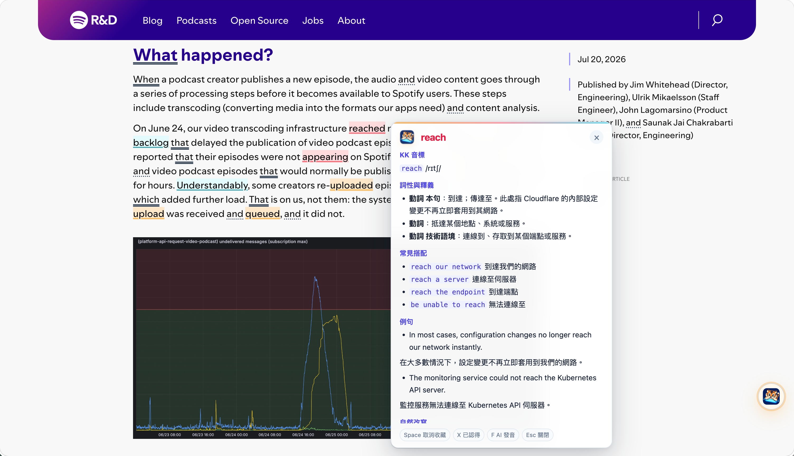
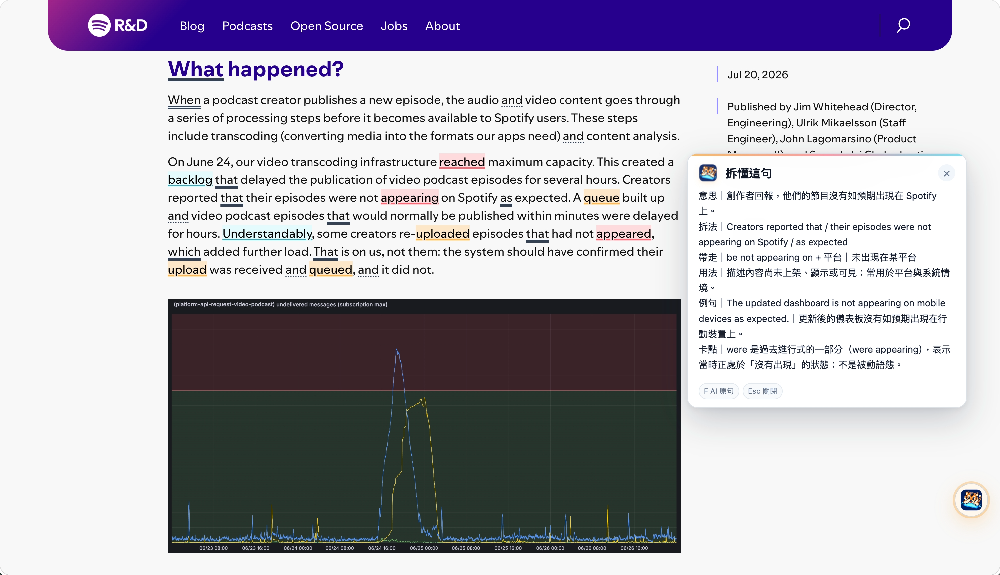
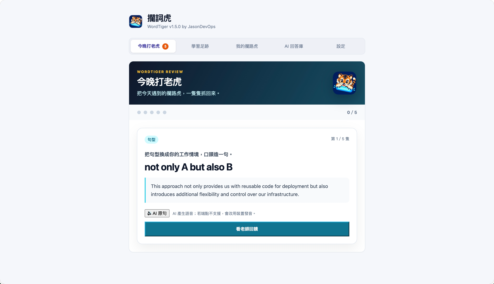
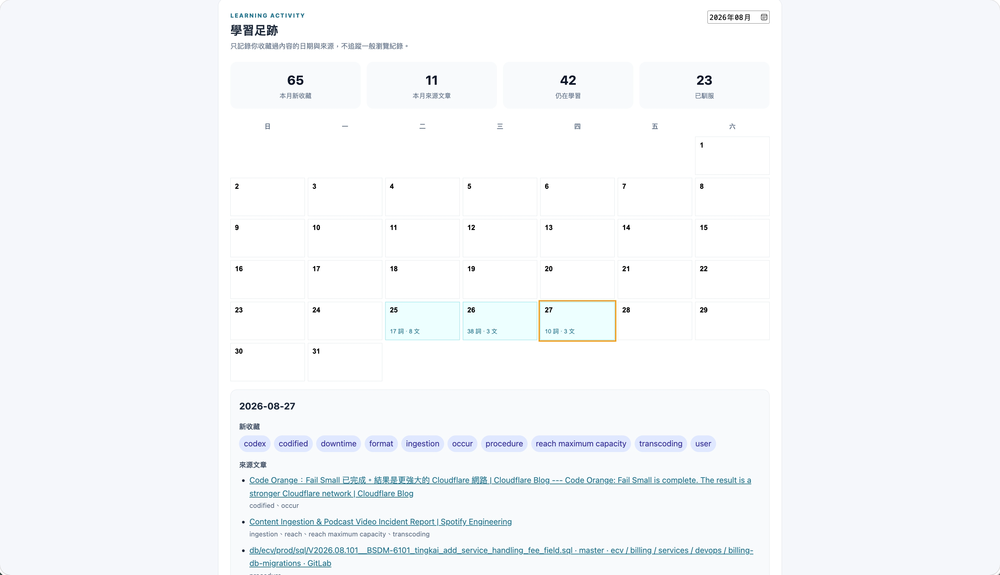

# 攔詞虎 WordTiger

> 把英文裡的攔路虎，一隻隻抓起來。

攔詞虎是一款英文網頁閱讀助手。它會依照你的詞彙程度標出生詞，讓你直接在文章裡查詞、理解長句、收藏語境，再用間隔複習把遇過的單字真正記住。



## 功能特色

- **依程度標出生詞**：用詞頻門檻控制難度，並以三種層級區分生詞。
- **不用離開文章查資料**：按快捷鍵即可查詞、快速看懂句意或拆解句型。
- **連同語境一起收藏**：保留單字出現的原句與來源，之後可回到真實情境複習。
- **今晚打老虎**：一輪 5 題，間隔由 FSRS 依每張卡的實際表現決定。答完整輪才收工，中途離開已作答的成績不會掉。
- **自然發音**：優先使用 AI 語音，無法使用時自動改用裝置內建英文語音。
- **本機優先**：離線也能高亮、收藏與複習已有詞典內容的卡片；需要跨裝置時再選擇啟用 Supabase 同步。

## 畫面預覽

### 快速看懂與拆懂長句



### 今晚打老虎



### 老虎足跡



## 開始使用

Edge 商店版本準備上架中，正式安裝連結將在通過審核後提供。

1. 安裝後到設定頁「AI 閱讀教練」填入自己的服務網址、金鑰與模型，按「測試 AI 連線」。AI 服務可能另行計費；攔詞虎不提供額度。
2. 打開英文文章，點小虎或按 `Alt+U` 啟用標示。
3. 滑鼠移到單字按 `A` 查詞，再按 `Space` 收藏；到「今晚打老虎」複習。

高亮與收藏不需 AI。離線複習需要已有詞典內容，片語另需來源語境。同步是選用功能，不需要先建立 Supabase 才能使用。

完整說明與隱私政策也可從擴充功能設定頁開啟，離線可閱讀。

## 開發者安裝

需要 Node.js 與 pnpm。安裝依賴並啟動開發環境：

```bash
pnpm install
pnpm dev
```

建立 Chrome／Edge 版本：

```bash
pnpm build
```

完成後，到瀏覽器的擴充功能頁開啟開發人員模式，選擇「載入未封裝項目」，載入 `.output/chrome-mv3`。

Safari 版本可用以下指令建立，產物位於 `.output/safari-mv3`：

```bash
pnpm build:safari
```

## AI 設定

高亮、收藏與複習不需要 AI；查詞、句意說明與拆句功能需要在設定頁填入：

1. Base URL
2. API Key
3. Model

預設使用 OpenAI API，也可改成其他相容 OpenAI Chat Completions API 的服務端點。API Key 儲存在瀏覽器本機，請求時會送給你設定的端點驗證。請只填入信任的服務網址；AI 文字與語音費用依該服務方案計算。連線測試只檢查文字生成，會送出一次可能計費的短請求。

## 操作方式

| 按鍵／入口 | 動作 |
|---|---|
| 工具列圖示 | 控制目前網站、調整高亮樣式並進入設定 |
| 小虎懸浮球 | 開關生詞標示；可拖曳到不影響閱讀的位置 |
| `Alt+U` | 開關目前頁面的生詞標示 |
| `A` | 查詢滑鼠所在單字 |
| `S` | 快速看懂所在句子 |
| `D` | 拆懂所在句子 |
| `F` | 朗讀單字或卡片中的完整原句 |
| `Space` | 將卡片中的單字加入或移出生詞 |
| `X` | 將單字標成已認得，或恢復自動判定 |
| `Esc` | 關閉卡片 |
| 工具列選單「今晚打老虎」 | 開始一輪間隔複習 |
| 設定頁「我的攔路虎」 | 收合列總表：搜尋、依學習進度篩選、依單字或片語篩選 |
| 設定頁「老虎足跡」 | 用月曆查看每天的收藏、來源文章與打老虎成績 |

## 生詞與複習規則

- 詞頻門檻代表你大致掌握的詞彙量；門檻以下不標示，以上依難度分成三層。
- 網址、品牌與詞頻表外的領域術語不會自動標示；手動收藏的生詞會優先顯示。
- 收藏單字時會一併保留所在句子；同一頁的相同句子不會重複儲存。
- 「快速看懂」聚焦句意與容易誤讀的關鍵，「拆懂」則補充句型結構、使用場景與例句。
- 「今晚打老虎」一輪 5 題，只挑選已到期的卡片與還沒練過的新卡，兩者都需要 AI 詞典（片語另外需要來源語境）才出題。答完整輪才收工，中途離開已作答的成績不會掉。
- 間隔由 `ts-fsrs` 決定，關掉分鐘級 learning steps，下次複習日對齊當地午夜。同一張卡不會在同一晚再出現。
- 複習時先看原句回想目標詞的意思，沒有原句則顯示單字；按「看答案」後再自評「記得／忘了」，才會儲存成績並進入下一題。揭曉答案不會呼叫 AI。
- 「我的攔路虎」的五個進度分類：今天排到、還沒練過、排程中、已馴服、全部。按 `X` 排除的字標成「已排除」，不列入學習進度。
- 「我的攔路虎」的每列會顯示「遇到 N 次」，數的是保留下來的語境筆數；同一句在同一頁重複收藏只算一次。
- 單字與片語是另一個獨立的篩選軸，可以跟學習進度同時使用。
- 1.8.0 之前用舊階梯練過的字顯示「升級後排程重新開始」：練習紀錄留著，FSRS 間隔從頭算。
- 「老虎足跡」只根據收藏、語境與複習成績產生，不記錄一般瀏覽歷史。
- 「新收藏」依收藏事件計算：按 `X` 排除的字不算收藏，收藏後馴服的字仍留在原本那天。

## 多裝置同步（選用）

攔詞虎採 local-first 設計。單字、語境、複習進度與 AI 詞典會先寫入 IndexedDB；未登入或離線時仍可正常使用。

若要跨裝置同步：

1. 建立 Supabase 專案。
2. 在 SQL Editor 執行 [`supabase/schema.sql`](supabase/schema.sql)。
3. 建立 email/password 使用者。
4. 在擴充功能設定頁填入 Project URL、anon key 與帳密後登入。

登入後會定期增量同步，也可手動立即同步。AI Key、prompt、高亮顏色，以及句子翻譯與拆句快取不會上傳。

## 開發

```bash
pnpm typecheck
pnpm test
pnpm build
pnpm build:safari
```

主要技術：WXT、Vue 3、TypeScript、Dexie、Vitest。

### 主要入口

- `entrypoints/highlight.content.ts`：生詞高亮、快捷鍵、卡片與 AI 串流顯示。
- `entrypoints/launcher.content.ts`：小虎懸浮球與高亮切換。
- `entrypoints/background.ts`：AI 請求、資料操作、自動注入與同步排程。
- `entrypoints/popup/`：工具列控制中心。
- `entrypoints/options/`：設定、收藏、複習與老虎足跡。
- `src/lib/decide.ts`：詞頻、手動標記與色階判定。
- `src/lib/ai.ts`：AI 查詢、串流解析與語音。
- `src/lib/db.ts`：本機資料與軟刪除規則。
- `src/lib/sync.ts`：Supabase 登入與增量同步。

高亮使用 CSS Custom Highlight API，不會包裹或修改網頁正文節點；content script 也不直接連外或操作 IndexedDB。

## 文件

- [架構決策](docs/adr/README.md)
- [版本變更紀錄](CHANGELOG.md)
- [功能設計](docs/superpowers/specs/2026-08-23-wordtiger-design.md)
- [P1 核心閉環計畫](docs/superpowers/plans/2026-08-23-p1-core-loop.md)
- [P3 加值功能計畫](docs/superpowers/plans/2026-08-24-p3-features.md)

## 介紹站與使用說明

`site/` 是不需前端框架的靜態介紹站，使用現有展示圖片。建置使用 `.node-version` 指定的 Node.js，不需安裝 npm 套件；`pnpm build:site` 仍可作為本機捷徑。商店尚未上架，頁面明示準備中；取得正式連結後再更新安裝入口。現有圖片有標示為較早版本，送審前應重拍。

```bash
node --test scripts/check-site.mjs
node scripts/build-site.mjs
python3 -m http.server 8080 --directory dist/site
```

開啟 `http://localhost:8080` 預覽，部署時只發布 `dist/site/` 的內容。`privacy.html` 由 `docs/privacy.md` 產生，擴充功能與網站使用同一份內容；請勿手改產物。`public/help.html` 是兩者共用的使用指南。網站尚未部署，建議使用 `https://wordtiger.jasondevops.space`；採 Cloudflare Pages Git 整合：分支預覽，合併到 `master` 後檢查並部署正式站；一次性連接步驟見 [Cloudflare Pages CI/CD](docs/cloudflare-pages.md)。正式網址與 Edge 商店連結須在啟用後驗證。

## 資料匯出

詞庫可匯出 JSON，包含單字、語境、複習與猜題紀錄，不包含 API 金鑰、設定或 AI 詞典快取。目前沒有匯入還原功能，因此不應把匯出視為完整備份。

## 資料來源

詞頻排名來自 SUBTLEX-US（Brysbaert & New, 2009），並在建置時透過 `subtlex-word-frequencies` 轉為本地資料；執行期間不會連外查詢詞頻。
